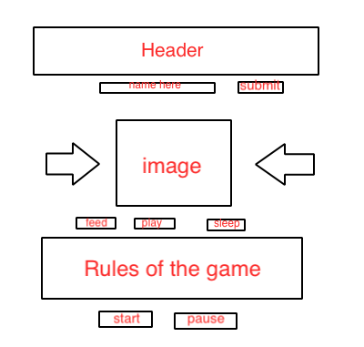

# jessica-tamagotchi-game1

# Jessica.-B-Project-0-

TAMAGOTCHI 

UNIT ONE GAME PROJECT 

### OVERVIEW: 

This version of the TAMAGOTCHI game was created as one of the projects for a Software Engineering Immersive Course. All of the documents including: HTML, CSS, and JAVASCRIPT were created by me. 

### USER STORY 

* The user must submit a name for their pet 
* User must click on the start button to begin the game
* User is allow to reset the game if need be
* Once the user has clicked on the start button, the stats of the TAMAGOTCHI pet will update at different intervals.
- hunger increases every two seconds 
- boredom increases every three seconds 
- sleepiness increases every four seconds
* user must make sure that the the stats does not reach 10. If so,  the pet will die. 
* When hunger reaches 10, "I died of hunger" will be display on the screen.
* When the boredom reaches 10, "I died of boredom" will be display on the screen. 
* when tired reaches 10, "I died of sleepiness" will be displayed on the screen. 

